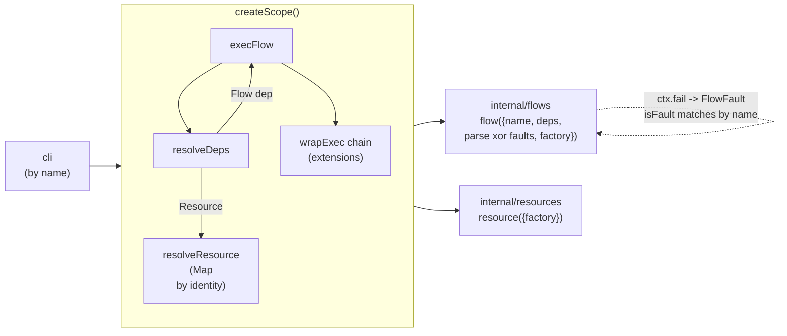

# CLAUDE.md

This file provides guidance to Claude Code (claude.ai/code) when working with code in this repository.

## Commands

```bash
npm test                                  # run vitest (packages/internal/__tests__)
npm run cli -- <flow-name> [json-input]   # run a flow by name via packages/cli/main.ts
npm run cli -- migration
npm run cli -- greet '{"name":"Ada"}'
```

Run a single test file: `npx vitest run packages/internal/__tests__/greet.test.ts`

There is no lint/typecheck script defined; use `npx tsc --noEmit` to typecheck against `tsconfig.json`.

## Architecture



- Aliases: `@core/*` → `packages/core`, `@internal/*` → `packages/internal` (tsconfig + vitest.config).
- Flow deps resolve to `FlowHandle.exec()`, re-entering `execFlow` — how flows call flows (`migration.ts`).
