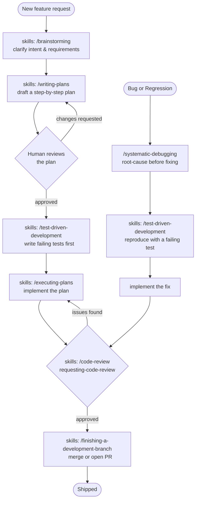

# Agentic AI and Testable code base

## Scripts

```bash
# Verify environment
node -v                                   # node version
npm -v                                    # npm version
git --version                             # git version
claude --version                          # Claude Code CLI version
claude doctor                             # check Claude Code installation health
# usage/quota is only available via the `/usage` slash command inside a session,
# there is no `claude usage` shell command

npm test                                  # run vitest
npx vitest run packages/internal/__tests__/greet.test.ts  # run a single test file

npm run cli -- <flow-name> [json-input]   # run a flow by name via packages/cli/main.ts
npm run cli -- migration
npm run cli -- greet '{"name":"Ada"}'
npm run cli -- phone-activations '{"inputPath":"assets/test_big_file.csv","outputPath":"assets/test_big_file.out.csv"}'
```

## Agentic workflow

Install the plugin first:

```
/plugin install superpowers@claude-plugins-official
```


